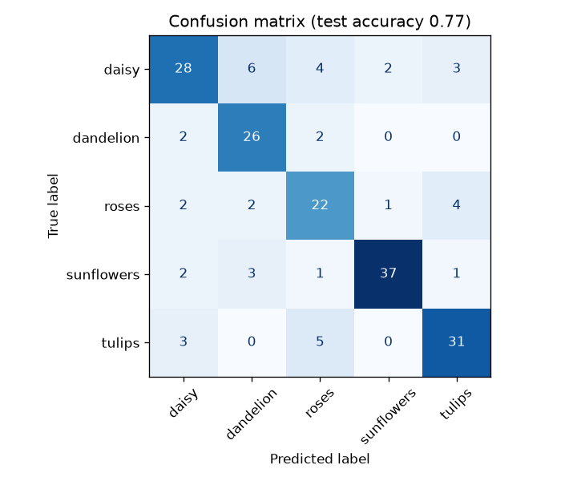
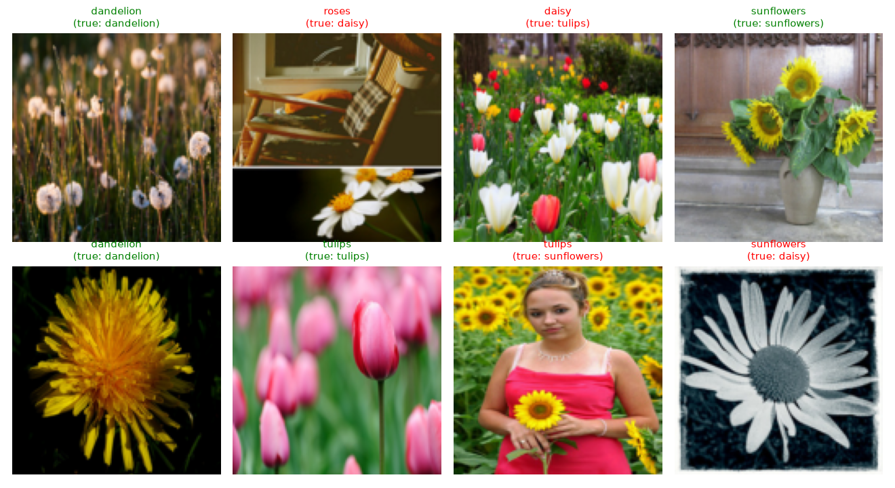

# Flower Image Classifier

Image classifier that recognises five flower species (daisy, dandelion, roses,
sunflowers, tulips) using **transfer learning** with a pre-trained ResNet-18.

Instead of training a convolutional network from scratch, the ImageNet backbone
is frozen and only a new classification head is trained. This reaches strong
accuracy on a small dataset and runs comfortably on CPU.

## Approach

1. **Data** — the flowers dataset is loaded with `ImageFolder`. Training images
   are augmented (random flips and rotations); all images are resized and
   normalised with ImageNet statistics. The set is split into train/validation/test.
2. **Model** — `resnet18` pre-trained on ImageNet, with the convolutional layers
   frozen and the final fully-connected layer replaced to output five classes.
3. **Training** — only the new head is optimised (Adam, cross-entropy). The best
   model by validation accuracy is checkpointed.
4. **Evaluation** — accuracy, per-class report and a confusion matrix on the
   held-out test set, plus a grid of sample predictions.

## Project structure

```
src/flowerclf/
  config.py      paths and hyperparameters
  data.py        transforms, per-class capping, dataloaders
  model.py       transfer-learning model factory
  train.py       training loop with validation and checkpointing
  evaluate.py    test metrics and figures
  predict.py     single-image inference CLI
tests/           unit tests for data and model
scripts/         dataset download
reports/         metrics and figures
```

## Usage

```bash
python -m venv .venv && source .venv/bin/activate
pip install torch torchvision --index-url https://download.pytorch.org/whl/cpu
pip install -e ".[dev]"

python scripts/download_data.py      # fetch the dataset
python -m flowerclf.train            # train and checkpoint the best model
python -m flowerclf.evaluate         # test metrics and figures
python -m flowerclf.predict path/to/flower.jpg
pytest
```

## Results

Training only the classification head for 10 epochs, validation accuracy rises
from 0.59 to ~0.79. On the held-out test set the model reaches **0.77 accuracy**
(random guessing would be 0.20 across five balanced classes).

| Class      | Precision | Recall | F1   |
| ---------- | --------- | ------ | ---- |
| daisy      | 0.76      | 0.65   | 0.70 |
| dandelion  | 0.70      | 0.87   | 0.78 |
| roses      | 0.65      | 0.71   | 0.68 |
| sunflowers | 0.93      | 0.84   | 0.88 |
| tulips     | 0.79      | 0.79   | 0.79 |

| Confusion matrix | Sample predictions |
| --- | --- |
|  |  |

Sunflowers are the easiest class; roses and tulips are most often confused with
each other, which is expected given their visual similarity. The backbone is
frozen and images are downscaled to 128px to keep training fast on CPU —
unfreezing the last ResNet block and training at 224px is the natural next step
to push accuracy higher.

## Possible improvements

- Fine-tune the deeper ResNet blocks with a lower learning rate.
- Add a learning-rate scheduler and early stopping.
- Export to TorchScript / ONNX for faster serving.
